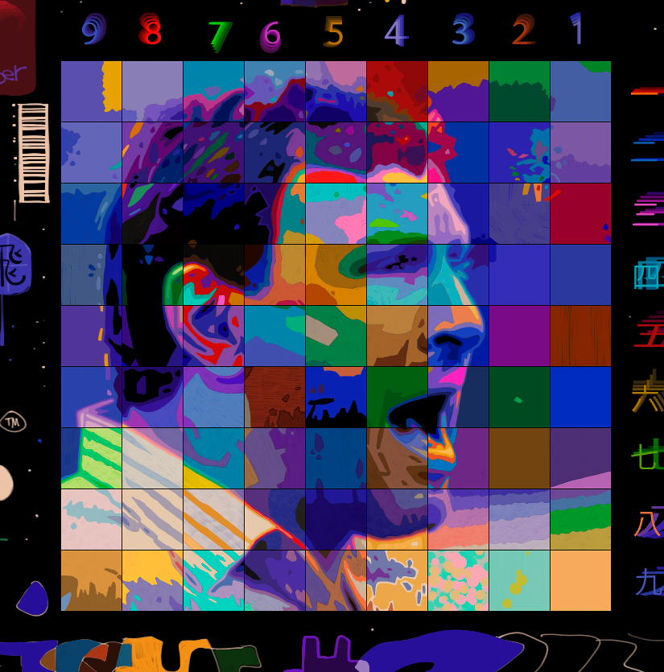
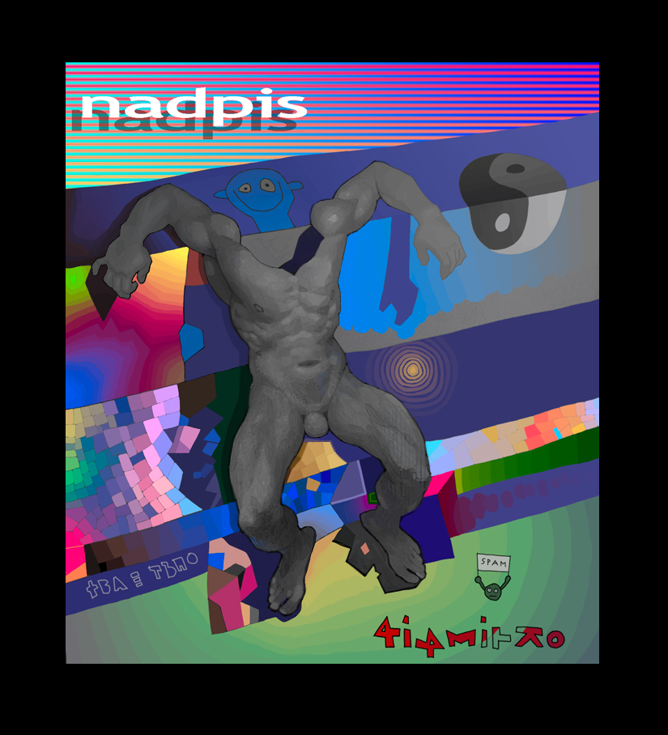

# Packing Rectangles
**HelloWorld** was a spaceship and I was a Captain logging into
***"As Follows"***, but it lasted only two issues.
[This](https://ioinformatics.org/files/ioi1995problem1.pdf)
is my first *IOI* problem:) It is moar than *825 px* wide zo it's in
*as_follows.ora* I've made some changes to the pictures:)
But I didn't touch the source files;)

# Shopping Offers
For the second
[problem](https://ioinformatics.org/files/ioi1995problem2.pdf),
I've tried ***Java***, the best language for such problems
for me is ***Python***, but the positive experince was installing
*NetBeans* cos *jdb* is not very friendly debugger:).

[Crackling Fireplace](https://youtu.be/3sL0omwElxw)
